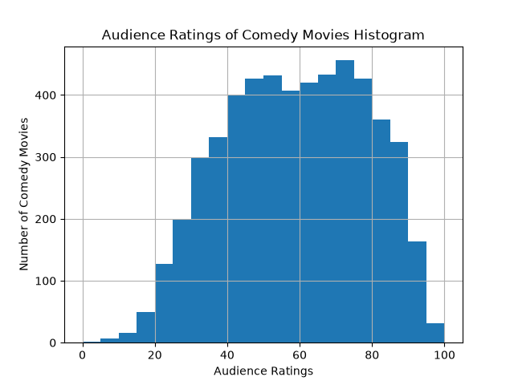
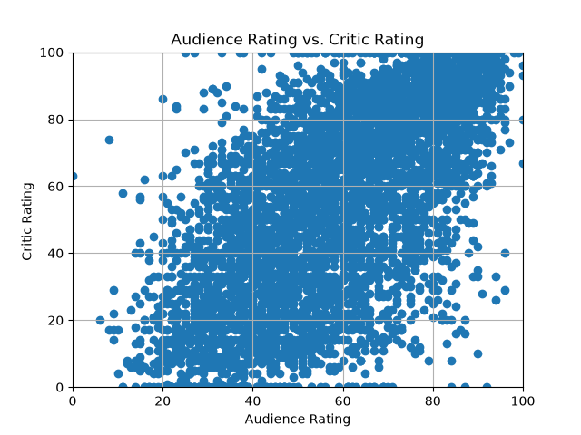

# Favorite Movie
a data analysis project on comparing your favorite movie's stats with different kinds of stats with other movies in the same genre

### Live Demo
Since this is a python application, I can't get a "live demo" for this through GitHub pages. Instead, this project can be viewed by making a copy of the repo and testing it out.
1. Make sure `main.py` and `rotten_tomatoes_movies.csv` are in the same folder.
2. Install the required libraries by typing this in the terminal:
`pip install pandas matplotlib`
3. Run the program by typing this in the terminal:
`python main.py`
4. Follow the prompts in the terminal and press Enter whenever it says "Press enter to continue."

Below, you can also see how the graphs of the data visualization looks without running the entire programs.

### Viewing the Graphs
The graphs don't pop up in a new window. Instead, they are saved as image files in the project folder:
* `histogram.png` shows the audience ratings of comedy movies.
* `scatterplot.png` shows audience ratings vs. critic ratings.

To see them, open the file explorer on the left side of your screen and click each file after the program has run. (If you don't see them, try refreshing the file explorer.)

### Built With
* Python
* pandas
* matplotlib

### P.S.
*This project is built as part of Girls Who Code's Intro to Data Science Course*